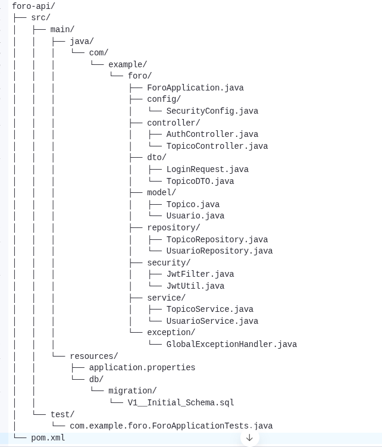

Practicando Spring Framework, API REST y SOLID: Challenge Foro Hub

La API esta centrada específicamente en los tópicos, y debe permitir a los usuarios:
* Crear un nuevo tópico;
* Mostrar todos los tópicos creados;
* Mostrar un tópico específico;
* Actualizar un tópico;
* Eliminar un tópico.

Los objetivo con este challenge es implementar una API REST con las siguientes funcionalidades:

* API con rutas implementadas siguiendo las mejores prácticas del modelo REST.
* Validaciones realizadas según las reglas de negocio.
* Implementación de una base de datos relacional para la persistencia de la información.
* Servicio de autenticación/autorización por medio de JWT.
* Documentación con Swagger.

## 🛠️ 1. Tecnologías Utilizadas

| TECNOLOGÍA          | PROPÓSITO                                 |
| ------------------- | ----------------------------------------- |
| Java 24             | Lenguaje principal                        |
| Spring Boot 3.x     | Framework para desarrollo rápido          |
| Spring Security     | Seguridad, autenticación y autorización   |
| JWT (Java JWT)      | Tokens de autenticación                   |
| Spring Data JPA     | Persistencia con base de datos relacional |
| Springdoc OpenAPI\| | Documentación automática de la API        |
| PostgreSQL          | Base de datos                             |

## 📦 2. Configuración Inicial

### 🧱 2.1. Crear proyecto Spring Boot

- **Project** : Maven
- **Language** : Java
- **Spring Boot Version** : 3.x
- **Dependencies** :
    - Spring Web
    - Spring Data JPA
    - Flyway Migration
    - Spring Security
    - Springdoc OpenAPI UI (springdoc-openapi-starter-webmvc-ui)
    - PostgreSQL Driver (o H2 para desarrollo)
    -

### 📁2.2. Estructura del Proyecto (ZIP)

![[Estructura_del_proyecto.png]]

